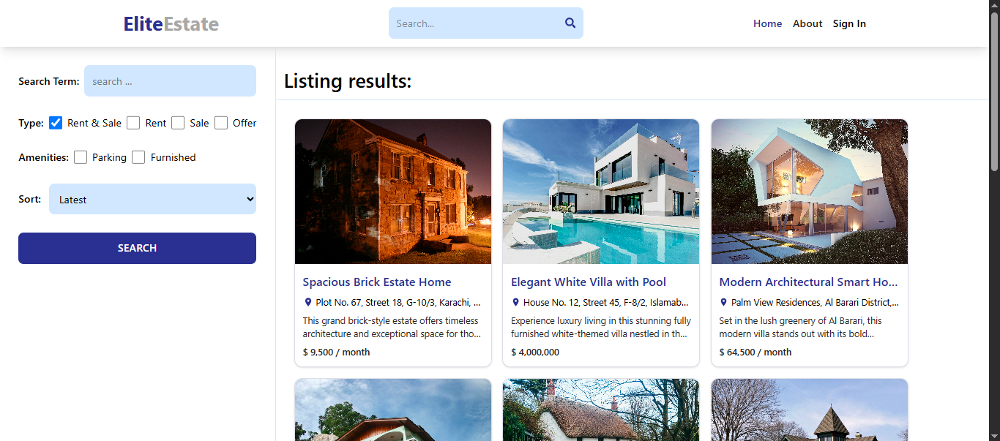
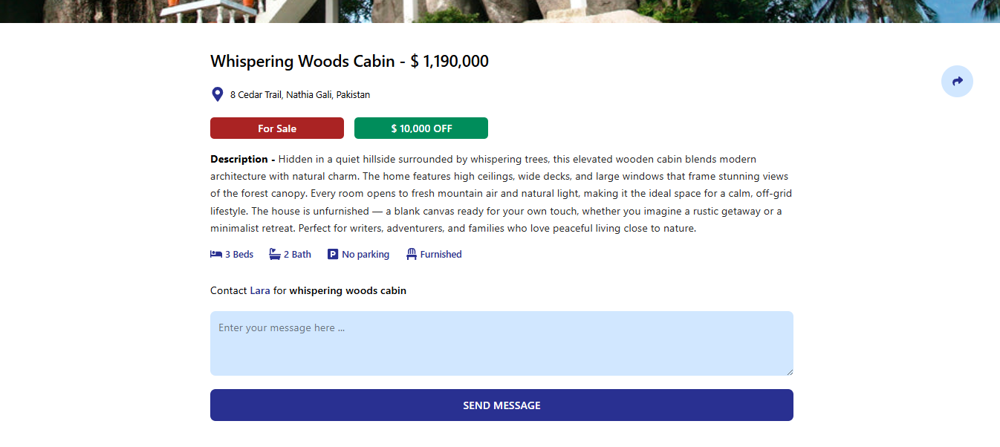
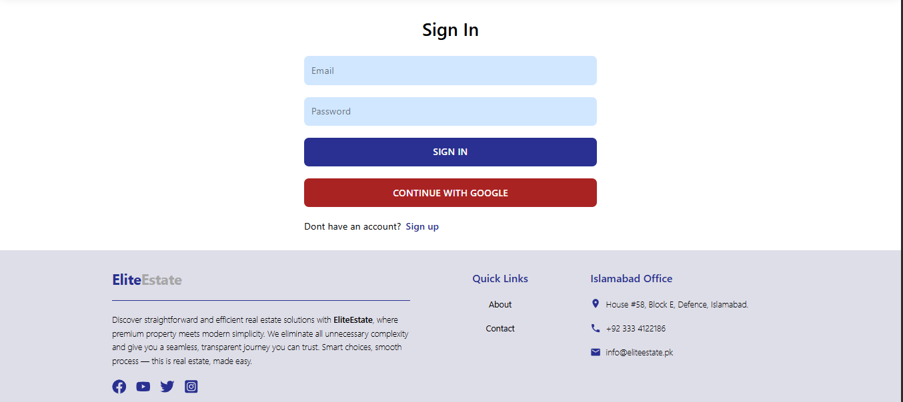
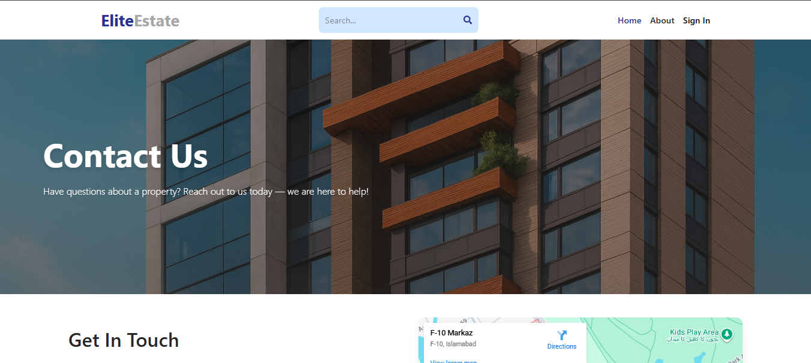

# EliteEstate

**EliteEstate** is a modern **MERN stack** real estate web application designed for buying, selling, and exploring properties. Users can manage their own listings—add, edit, or delete properties for sale or rent—with images stored on **Cloudinary**.

---

## 🌟 Features

### General Features

- Fully responsive and modern UI using **React** and **Tailwind CSS**.
- Browse property listings with details like **images**, **price**, **type**, and **location**.
- Search and filter by **location**, **price**, or **property type**.
- Dynamic banner sections with high-quality images.
- Modern UI elements using **React Icons**.
- **User profiles**: each user can manage their own listings.

### User Features

- **Register & login** (JWT-based authentication).
- Add new property listings with **Cloudinary image uploads**.
- Edit or delete their own property listings.
- View a list of all properties they have added.
- Contact other users or property owners via contact forms.

---

## 🛠 Tech Stack

- **Frontend:** React, Tailwind CSS, React Router, React Icons
- **Backend:** Node.js, Express.js
- **Database:** MongoDB (with Mongoose)
- **Authentication:** JWT-based secure authentication
- **Image Storage:** Cloudinary for property images
- **Routing:** Protected routes for user actions

---

## 🚀 Installation

### Backend

1. Clone the repository:

```bash
git clone <>
cd EliteEstate/backend
```

2. Install dependencies:

```bash
npm install
```

3. Create a `.env` file with the following:

```
MONGO_URI=<your_mongodb_connection_string>
JWT_SECRET=<your_jwt_secret>
CLOUDINARY_CLOUD_NAME=<your_cloud_name>
CLOUDINARY_API_KEY=<your_api_key>
CLOUDINARY_API_SECRET=<your_api_secret>
```

4. Start the server:

```bash
npm run dev
```

### Frontend

1. Navigate to frontend folder:

```bash
cd EliteEstate/frontend
```

2. Install dependencies:

```bash
npm install
```

3. Start the React app:

```bash
npm run dev
```

---

## ⚡ Usage

- **Register/login** to create a user profile.
- Users can **add property listings** with images uploaded to Cloudinary.
- Users can **edit or delete** only their own listings.
- Users can view all their own listings in their profile page.
- Other users can browse all listings and contact owners via the contact form.

---

## 🖼 Screenshots / Demo







---

## 📌 Notes

- Each user has a **personal profile** showing all listings they added.
- Property images are stored on **Cloudinary**, not locally.
- Tailwind CSS and React Icons are used for modern styling and responsive UI.
- JWT authentication ensures **only owners can edit/delete their own listings**.

---

## 🏷 License

This project is licensed under the **MIT License**.

---
